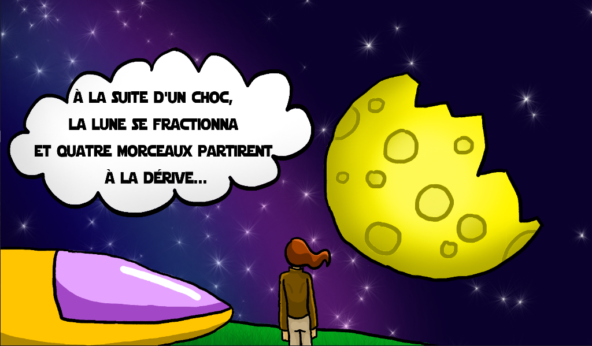
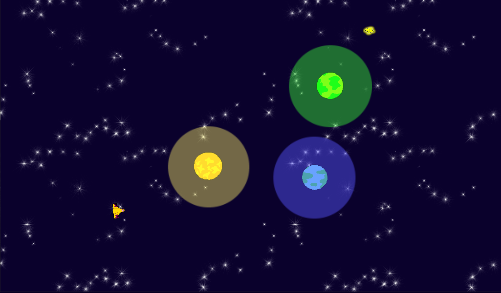
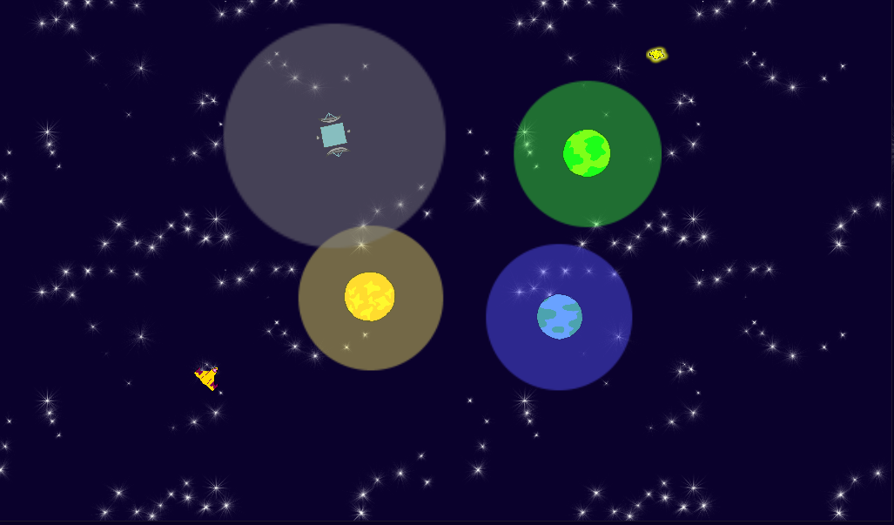

# Lunarium

Lunarium is a game created for a 2 days Game Jam in october 2021 where the theme was "Lunar".

Technologies: Godot

Game made by Hugo Barrandon, Antonin Devidal, Coline Ledez, Ivan Le Teuff

Plot: The moon exploded and some part of the moon were lost. With your spaceship, your goal is to bring back the 4 shards lost.

In this game, you control a spaceship with your mouse and you need to select the right angle to launch your ship to get the moon shard. For that you need to be carefull of the planets and their gravitational force. 

If the level is too complicated, you can help yourself by placing a satelitte with your right click and changing the gravitational force with the scrollwheel.

